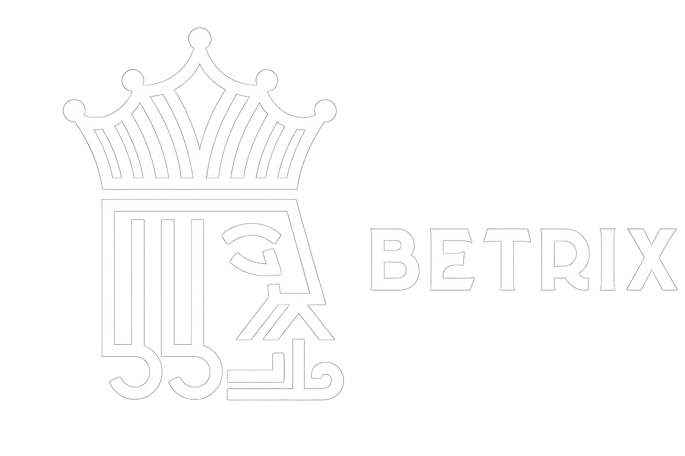

<!-- Improved compatibility of back to top link: See: https://github.com/othneildrew/Best-README-Template/pull/73 -->

<a id="readme-top"></a>

<!--
*** Thanks for checking out the Best-README-Template. If you have a suggestion
*** that would make this better, please fork the repo and create a pull request
*** or simply open an issue with the tag "enhancement".
*** Don't forget to give the project a star!
*** Thanks again! Now go create something AMAZING! :D
-->

<!-- PROJECT SHIELDS -->
<!--
*** I'm using markdown "reference style" links for readability.
*** Reference links are enclosed in brackets [ ] instead of parentheses ( ).
*** See the bottom of this document for the declaration of the reference variables
*** for contributors-url, forks-url, etc. This is an optional, concise syntax you may use.
*** https://www.markdownguide.org/basic-syntax/#reference-style-links
-->

[](https://github.com/GeorgioCharro/Betrix/graphs/contributors)
[](https://github.com/GeorgioCharro/Betrix/network/members)
[](https://github.com/GeorgioCharro/Betrix/stargazers)
[](https://github.com/GeorgioCharro/Betrix/issues)
[![Unlicense License][license-shield]][license-url]
[](https://www.linkedin.com/in/georgio-charro-59280a1b2/)

<!-- PROJECT LOGO -->
<br />
<div align="center">
  <a href="https://github.com/GeorgioCharro/Betrix">
    
  </a>

  <h3 align="center">Betrix SimCasino</h3>

  <p align="center">
    <br />
    <a href="https://github.com/GeorgioCharro/Betrix"><strong>Explore the docs »</strong></a>
    <br />
    <br />
    <a href="https://cozy-pavlova-764e8b.netlify.app/">View Demo</a>
    &middot;
    <a href="https://github.com/GeorgioCharro/Betrix/issues/new?labels=bug&template=bug-report---.md">Report Bug</a>
    &middot;
    <a href="https://github.com/GeorgioCharro/Betrix/issues/new?labels=enhancement&template=feature-request---.md">Request Feature</a>
  </p>
</div>

<details>
  <summary>Table of Contents</summary>
  <ol>
    <li><a href="#about-the-project">About The Project</a>
      <ul>
        <li><a href="#built-with">Built With</a></li>
      </ul>
    </li>
    <li><a href="#getting-started">🚀 Getting Started</a>
      <ul>
        <li><a href="#prerequisites">1. Prerequisites</a></li>
        <li><a href="#clone-the-repository">2. Clone the Repository</a></li>
        <li><a href="#configure-environment-variables">3. Configure Environment Variables</a></li>
        <li><a href="#install-dependencies">4. Install Dependencies</a></li>
        <li><a href="#prepare-the-database">5. Prepare the Database</a></li>
        <li><a href="#start-the-development-servers">6. Start the Development Servers</a></li>
      </ul>
    </li>
    <li><a href="#usage">📖 Usage</a></li>
    <li><a href="#project-structure">🧱 Project Structure</a></li>
    <li><a href="#server-architecture">⚙️ Server Architecture</a></li>
    <li><a href="#authentication-workflow">🔐 Authentication Workflow</a></li>
    <li><a href="#user--provably-fair-subsystem">🎲 User & Provably Fair Subsystem</a></li>
    <li><a href="#game-modules">🎮 Game Modules</a></li>
    <li><a href="#api-architecture">🏗 API Architecture</a></li>
    <li><a href="#data--transactions">🗃️ Data & Transactions</a></li>
    <li><a href="#frontend">💻 Frontend</a></li>
    <li><a href="#contributing">🤝 Contributing</a></li>
    <li><a href="#license">📝 License</a></li>
    <li><a href="#contact">📬 Contact</a></li>
    <li><a href="#acknowledgments">🙏 Acknowledgments</a></li>
  </ol>
</details>

<!-- ABOUT THE PROJECT -->

## About The Project

[![Product Name Screen Shot][product-screenshot]](https://example.com)

Betrix is an online casino project developed out of my personal interest in gambling systems — not to promote gambling, but to explore how popular games like Plinkoo, Roulette, Mines, Keno, and Dice function behind the scenes. I'm fascinated by the logic that powers these games and how casinos build profitability through concepts like house edge.

This project is also a showcase of my full-stack development skills. It leverages modern technologies including:

GraphQL for flexible API interactions

PostgreSQL and Prisma for robust data modeling

React for building responsive and reactive user interfaces

Through Betrix, I’ve implemented provably fair game logic, real-time balance updates, and a modular architecture designed for scalability. It’s both a technical deep dive into game mechanics and a practical demonstration of building secure, production-grade web applications using modern tooling.

<p align="right">(<a href="#readme-top">back to top</a>)</p>

### Built With

- [![React][React.js]][React-url]
- [![TypeScript][TypeScript.ts]][TypeScript-url]
- [![ShadCN][ShadCN.ui]][ShadCN-url]
- [![Tailwind][Tailwind.css]][Tailwind-url]
- [![Vite][Vite.js]][Vite-url]
- [![GraphQL][GraphQL.graphql]][GraphQL-url]
- [![Apollo][Apollo.apollo]][Apollo-url]
- [![Express][Express.js]][Express-url]
- [![PostgreSQL][Postgres.pg]][Postgres-url]
- [![Prisma][Prisma.prisma]][Prisma-url]

<p align="right">(<a href="#readme-top">back to top</a>)</p>

<!-- Badges -->

[React.js]: https://img.shields.io/badge/React-20232a?style=for-the-badge&logo=react&logoColor=61dafb
[React-url]: https://reactjs.org/
[TypeScript.ts]: https://img.shields.io/badge/TypeScript-3178c6?style=for-the-badge&logo=typescript&logoColor=white
[TypeScript-url]: https://www.typescriptlang.org/
[ShadCN.ui]: https://img.shields.io/badge/ShadCN/UI-111827?style=for-the-badge&logo=tailwindcss&logoColor=38bdf8
[ShadCN-url]: https://ui.shadcn.com/
[Tailwind.css]: https://img.shields.io/badge/Tailwind_CSS-38bdf8?style=for-the-badge&logo=tailwindcss&logoColor=white
[Tailwind-url]: https://tailwindcss.com/
[Vite.js]: https://img.shields.io/badge/Vite-646cff?style=for-the-badge&logo=vite&logoColor=white
[Vite-url]: https://vitejs.dev/
[GraphQL.graphql]: https://img.shields.io/badge/GraphQL-e535ab?style=for-the-badge&logo=graphql&logoColor=white
[GraphQL-url]: https://graphql.org/
[Apollo.apollo]: https://img.shields.io/badge/Apollo_GraphQL-311C87?style=for-the-badge&logo=apollo-graphql&logoColor=white
[Apollo-url]: https://www.apollographql.com/
[Express.js]: https://img.shields.io/badge/Express.js-000000?style=for-the-badge&logo=express&logoColor=white
[Express-url]: https://expressjs.com/
[Postgres.pg]: https://img.shields.io/badge/PostgreSQL-4169e1?style=for-the-badge&logo=postgresql&logoColor=white
[Postgres-url]: https://www.postgresql.org/
[Prisma.prisma]: https://img.shields.io/badge/Prisma-2d3748?style=for-the-badge&logo=prisma&logoColor=white
[Prisma-url]: https://www.prisma.io/

## 🚀 Getting Started

Follow these steps to run the project locally:

### 1. Prerequisites

Make sure you have the following installed:

- [Node.js](https://nodejs.org/) (v18 or higher)
- [pnpm](https://pnpm.io/) (a fast, disk space-efficient package manager)

### 2. Clone the Repository

```sh
git clone https://github.com/your-username/simcasino.git
cd simcasino
```

### 3. Configure Environment Variables

Copy the example environment files and provide the required values:

```sh
cp apps/api/.env.example apps/api/.env
cp packages/db/.env.example packages/db/.env
```

> 🛠️ Fill in the `.env` files with your database URL, API secrets, and other required credentials.

### 4. Install Dependencies

```sh
pnpm install
```

This installs all packages across the monorepo using Turborepo and pnpm workspaces.

### 5. Prepare the Database

Run database migrations and generate the Prisma client:

```sh
pnpm db:migrate
pnpm db:generate
```

### 6. Start the Development Servers

Start all apps in development mode:

```sh
pnpm run dev
```

> ✅ This command launches both:
>
> - The **Express GraphQL API** at `http://localhost:5000`
> - The **Vite + React frontend** at `http://localhost:3000`  
>   (or `http://localhost:5173` if the default Vite port is used)

<p align="right">(<a href="#readme-top">back to top</a>)</p>

<!-- USAGE EXAMPLES -->
<!-- USAGE EXAMPLES -->

## 📖 Usage

SimCasino is a monorepo managed with **Turborepo** and **pnpm**.  
It contains two applications:

- An **Express + Apollo GraphQL API**
- A **Vite + React frontend**

It also includes shared packages for database access and provably fair game utilities.

---

### 🧱 Project Structure

- Game logic follows a `controller/service` pattern under:  
  `apps/api/src/features/games`

- Each game exposes its own **REST** endpoints and uses a **provably fair** RNG system powered by user seeds and nonces.

---

### ⚙️ Server Architecture

#### Express Server

- Configured via `createServer`
- Handles:
  - Logging
  - CORS
  - JSON parsing
  - Sessions
  - Passport-based auth
- Mounts:
  - `/api/v1/auth` → Auth routes
  - `/api/v1/games` → Game logic routes
  - Initializes Apollo Server for GraphQL support

#### WebSocket Layer

- A `WebSocketServer` is bound to the HTTP server
- Greets new connections and exposes `broadcastBalanceUpdate` to push live balance updates to clients

---

### 🔐 Authentication Workflow

Authentication logic is in `auth.router.ts`:

- **Google OAuth**

  - `/google` initiates login
  - `/google/callback` processes the response and redirects

- **Local Login**

  - `/login` uses Passport's local strategy
  - Returns user data (excluding password) on success

- **Register**

  - Validates input, ensures unique email/username
  - Hashes password (bcrypt)
  - Initializes user level, XP, and seeds
  - Persists to DB

- **`/me` route**

  - Protected via `isAuthenticated` middleware
  - Returns the current session user

- **Passport strategies**
  - Configured in `config/passport.ts`
  - Uses session-based cookies with user ID serialization

---

### 🎲 User & Provably Fair Subsystem

- `user.service.ts` tracks each user’s provably fair state
- Each `UserInstance` contains:
  - Server/client seeds
  - A nonce
- `generateFloats()` produces deterministic floats via HMAC
- `rotateSeed()` rotates the server seed and resets the nonce
- `UserManager` lazily creates and caches user states

Controllers expose:

- Balance checks
- Provably fair state inspection
- Seed rotation
- Bet history

---

### 🎮 Game Modules

All routes under `/api/v1/games/:game` require authentication.  
Each controller:

1. Validates input
2. Loads the user and provably fair state
3. Generates game outcomes
4. Debits balance, calculates payouts, and persists bets in a Prisma transaction

#### **Games Included:**

- **🎲 Dice**

  - One float → 0–100
  - Multiplier computed by target & direction (above/below)
    ▶️ [Watch demo](https://vimeo.com/1106741261)

- **🎡 Roulette**

  - One float → number 0–36
  - Payouts support all traditional types (straight, corner, parity, etc.)
    ▶️ [Watch demo](https://vimeo.com/1106741308)

- **🎯 Keno**

  - Ten floats → ten drawn numbers
  - Matched tiles → payout multiplier from risk table
    ▶️ [Watch demo](https://vimeo.com/1106741275)

- **💣 Mines**

  - Floats → mine positions
  - `playRound` tracks picks, mines, and finalizes cashout/mine hit
    ▶️ [Watch demo](https://vimeo.com/1106741289)

- **🪙 Plinkoo**

  - Simulated path via `Math.random`
  - Counts right moves and returns multiplier from payout table
    ▶️ [Watch demo](https://vimeo.com/1106741301)

- **🃏 Blackjack**

  - Uses `BlackjackManager` to generate 52-card deck from floats
  - `BlackjackGame` controls state, actions, card draws, and payout

- **💥 Limbo**
  - Placeholder: fixed float & 1% house edge
  - Real RNG implementation pending (`TODO` in source)

---

## 🏗 API Architecture

The backend exposes both a **REST API** and a **GraphQL API**, all mounted on an **Express** server.

---

### ⚙️ Server Setup

- `createServer` configures middleware for:
  - Logging
  - CORS
  - Sessions
  - Passport authentication
  - REST routes
- It initializes **Apollo Server** for GraphQL.
- A `/health` endpoint is exposed for health checks before mounting feature routers under `/api/v1`.

**Routers:**

- `authRouter`
- `gameRouter`
- `userRouter` (currently not mounted in `server.ts`)

---

### 🔐 Authentication and User Endpoints

- The **auth router** handles:

  - **Google OAuth** login
  - Local login
  - Registration
  - Logout
  - A session-backed `/me` route to fetch the current user

- The **user router** provides (requires authentication):
  - Balance retrieval
  - Provably fair **seed rotation**
  - **Server-seed reveal**
  - **Bet history**

---

### 🎮 Game Endpoints

- A top-level **games router** delegates to individual game routers, mounted under:
  ```
  /api/v1/games/<game>
  ```
- Supported games:
  - Plinkoo
  - Mines
  - Limbo
  - Keno
  - Dice
  - Roulette
  - Blackjack

---

### 🧩 GraphQL Layer

- **Apollo Server** is initialized at:
  ```
  /graphql
  ```
- It combines schema and resolver modules.
- The Express session context is shared with GraphQL.

**Game-specific operations include:**

- `placeDiceBet`
- `startMines`
- `blackjackBet`
- `playLimbo`

These are handled by the **games resolver set**.

---

### 🔄 WebSocket Support

- A **WebSocket server** runs alongside the HTTP server.
- It broadcasts real-time balance updates to all connected clients via:
  ```
  broadcastBalanceUpdate
  ```

---

### 🛠 Overall Flow

- **Express routes** serve:

  - Authentication
  - User endpoints
  - Per-game REST endpoints

- **Apollo Server** handles:

  - GraphQL queries and mutations for bets and game interactions

- **Sessions (via Passport)** secure both REST and GraphQL layers.
- **WebSockets** push live balance changes to the frontend clients.

---

<p align="right">(<a href="#readme-top">back to top</a>)</p>

### 🗃️ Data & Transactions

- Prisma schema defines:
  - `User`
  - `ProvablyFairState`
  - `Bet`
- All monetary values stored in **cents**
- Each bet links to a provably fair state
- Database transactions are used to:
  - Create bets
  - Update balances
  - Ensure consistent ledger history

---

### 💻 Frontend

Located in `apps/frontend`, the UI is built with:

- **React** + **Vite**
- **Apollo Client** for GraphQL
- **TanStack Router**
- **Tailwind CSS** with **ShadCN**

It consumes both the REST and GraphQL APIs.  
Shared logic and TypeScript types are imported from `packages/common` to ensure server-client consistency.

---

<p align="right">(<a href="#readme-top">back to top</a>)</p>

## Contributing

Contributions are what make the open source community such an amazing place to learn, inspire, and create. Any contributions you make are **greatly appreciated**.

If you have a suggestion that would make this better, please fork the repo and create a pull request. You can also simply open an issue with the tag "enhancement".
Don't forget to give the project a star! Thanks again!

1. Fork the Project
2. Create your Feature Branch (`git checkout -b feature/AmazingFeature`)
3. Commit your Changes (`git commit -m 'Add some AmazingFeature'`)
4. Push to the Branch (`git push origin feature/AmazingFeature`)
5. Open a Pull Request

### Top contributors:

<a href="https://github.com/GeorgioCharro/Betrix/graphs/contributors">
  
</a>

<p align="right">(<a href="#readme-top">back to top</a>)</p>

<!-- LICENSE -->

## License

Distributed under the Unlicense License. See `LICENSE.txt` for more information.

<p align="right">(<a href="#readme-top">back to top</a>)</p>

<!-- CONTACT -->

## Contact

Georgio Charro - georgiocharro@hotmail.com

Project Link: [https://github.com/GeorgioCharro/Betrix](https://github.com/GeorgioCharro/Betrix)

<p align="right">(<a href="#readme-top">back to top</a>)</p>

<!-- ACKNOWLEDGMENTS -->

## Acknowledgments

List of resources I found helpful and would like to give credit to.

- [@Harkirat Singh](https://www.youtube.com/watch?v=l5bRPWxun4A&t=4998s)
- [@nimit9 ](https://github.com/code100x/plinkoo/pull/24)
- [@othneildrew](https://github.com/othneildrew/Best-README-Template)

<p align="right">(<a href="#readme-top">back to top</a>)</p>

<!-- MARKDOWN LINKS & IMAGES -->
<!-- https://www.markdownguide.org/basic-syntax/#reference-style-links -->

[contributors-shield]: https://img.shields.io/github/contributors/othneildrew/Best-README-Template.svg?style=for-the-badge
[contributors-url]: https://github.com/othneildrew/Best-README-Template/graphs/contributors
[forks-shield]: https://img.shields.io/github/forks/othneildrew/Best-README-Template.svg?style=for-the-badge
[forks-url]: https://github.com/othneildrew/Best-README-Template/network/members
[stars-shield]: https://img.shields.io/github/stars/othneildrew/Best-README-Template.svg?style=for-the-badge
[stars-url]: https://github.com/othneildrew/Best-README-Template/stargazers
[issues-shield]: https://img.shields.io/github/issues/othneildrew/Best-README-Template.svg?style=for-the-badge
[issues-url]: https://github.com/othneildrew/Best-README-Template/issues
[license-shield]: https://img.shields.io/github/license/othneildrew/Best-README-Template.svg?style=for-the-badge
[license-url]: https://github.com/othneildrew/Best-README-Template/blob/master/LICENSE.txt
[linkedin-shield]: https://img.shields.io/badge/-LinkedIn-black.svg?style=for-the-badge&logo=linkedin&colorB=555
[linkedin-url]: https://linkedin.com/in/othneildrew
[product-screenshot]: ./apps/frontend/public/logo-readme.png
[Next.js]: https://img.shields.io/badge/next.js-000000?style=for-the-badge&logo=nextdotjs&logoColor=white
[Next-url]: https://nextjs.org/
[React.js]: https://img.shields.io/badge/React-20232A?style=for-the-badge&logo=react&logoColor=61DAFB
[React-url]: https://reactjs.org/
[Vue.js]: https://img.shields.io/badge/Vue.js-35495E?style=for-the-badge&logo=vuedotjs&logoColor=4FC08D
[Vue-url]: https://vuejs.org/
[Angular.io]: https://img.shields.io/badge/Angular-DD0031?style=for-the-badge&logo=angular&logoColor=white
[Angular-url]: https://angular.io/
[Svelte.dev]: https://img.shields.io/badge/Svelte-4A4A55?style=for-the-badge&logo=svelte&logoColor=FF3E00
[Svelte-url]: https://svelte.dev/
[Laravel.com]: https://img.shields.io/badge/Laravel-FF2D20?style=for-the-badge&logo=laravel&logoColor=white
[Laravel-url]: https://laravel.com
[Bootstrap.com]: https://img.shields.io/badge/Bootstrap-563D7C?style=for-the-badge&logo=bootstrap&logoColor=white
[Bootstrap-url]: https://getbootstrap.com
[JQuery.com]: https://img.shields.io/badge/jQuery-0769AD?style=for-the-badge&logo=jquery&logoColor=white
[JQuery-url]: https://jquery.com
